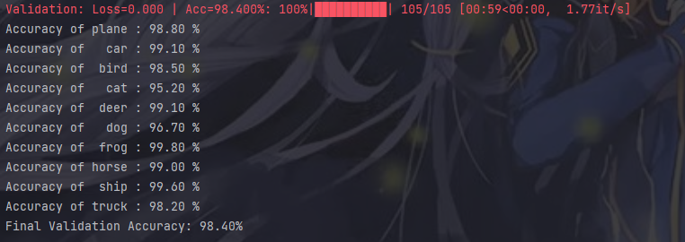

# 基于龙芯平台的图像分类系统


## 项目结构

```
│  auto_augment.py   # 数据增强类
│  CIFAR10_socket.py # 模型socket通信类
│  CIFAR10_utils.py  # 模型功能类
│  model.py          # 神经网络定义类
│  nasnet_set.py     # 网络结构搜索类
│  operations.py     # 网络结构操作类
│  run_cli.py        # CLI界面启动程序
│  run_web.py        # WEB界面启动程序
│  utils.py          # 模型训练工具类
│
├─data # CIFAR10数据集
│
├─model
│      top1.pt # 98.40% 准确率模型文件
│
├─runs # TensorBoard文件夹
│  └─Aug3_16-58-49_ius
│          events.out.tfevents.1691053128.autodl-container-5fcb458f92-a9026c48.1372.0
│          events.out.tfevents.1691112012.autodl-container-ea5a488e8d-bf231c11.396.0
│          events.out.tfevents.1691166717.dsw-253083-d84bbcf5f-7c74t.268.0
│          events.out.tfevents.1691634045.dsw-253083-67587b5f78-c7skj.1988.0
│          log.txt #模型训练过程文本记录
│
├─static # 静态资源
│  ├─css
│  │
│  ├─img
│  │
│  ├─js
│  │
│  └─upload # 上传文件存放目录
│
├─templates # 前端模板文件
│
└─__pycache__

```


## 基本介绍

本作品的主要创新点和亮点包括：

1. **LoongArch架构的应用**：本作品将图像分类任务扩展到了龙芯服务器上，充分利用了龙芯3C5000 CPU的计算能力，拓展了自主CPU在人工智能领域的应用场景。

2. **基于LaNet的图像分类**：为了实现高效准确的图像分类，我们使用了开源的**LaNet**模型，并使用了**NAS**进行最佳模型的构建，引入了**CutMix**和**AutoAugment**对训练集进行预处理，同时使用**EMA**对模型参数进行指数滑动平均，最终取得了**98.40%**的准确率。

3. **多种用户界面的选择：**我们为用户开发了两种UI界面，分别是CLI界面、WEB界面，CLI界面简洁，系统占用率低。WEB界面精美，使用简易。

4. **可视化面板的应用：**我们在模型的训练过程中，使用了TensorBoard面板进行了模型准确率和Loss值的记录，具有重要的参考意义。

   

一、在本地平台上进行模型准确率的验证，可以达到**98.40%**的准确率



二、在**龙芯平台**上进行模型测试，也能达到**98.23%**的准确率


三、为了增强用户的体验感，该系统具有两种可选的可视化界面

###### CLI界面：界面简洁、系统占用率低


###### WEB界面：界面优美、系统占用率略高


WEB界面采用websocket技术，可以将模型训练、评估、预测的数据实时的反馈到前端，还可以在局域网的多端观察模型训练情况，实现前端后端的实时通信。


## 训练过程

使用Tensorboard进行准确率、loss数据记录


## 使用方法

#### 1.安装环境依赖

```
pip install -r requirements.txt
cd ./cutmix-master
python setup.py install
```


#### 2.运行启动程序

##### CLI界面

```
python run_cli.py
```


##### WEB界面

###### 推荐使用1600*900及以上的分辨率，以便取得更好的体验

```
python run_web.py
```
